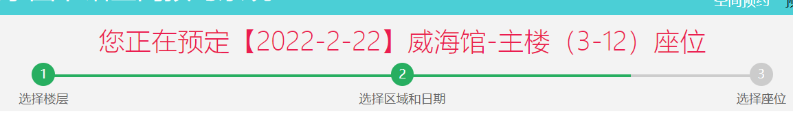

# SDU-SEAT

山东大学图书馆自动预约脚本，支持webVpn

## 近期更新
``2023-04-24``

* 学校图书馆更换了新域名，修复了无法登录的问题(注：webvpn由于学校还未开放新域名的访问权限，暂时无法使用，待学校开放后修复)

## 使用方法

### 安装Java

本项目使用运行于JVM的kotlin进行编写，使用前请先安装Java

安装教程：[各系统安装Java教程](https://cloud.tencent.com/developer/article/1957454)

### 获取jar包

从[Release](https://github.com/fengyuecanzhu/Sdu-Seat/releases/)/[Actions](https://github.com/fengyuecanzhu/Sdu-Seat/actions/workflows/build.yml)下载或者[自行编译](#编译)

### 运行

> 运行前请在config文件夹下新建config.json文件并配置相关[参数](#参数说明)（可自定义文件路径），可根据config.example.json文件进行配置，配置修改后必须**重启脚本**

> 脚本将会每日按照设定的时间定时预约座位

```shell
java -jar sdu-seat.jar
# 自定义配置文件路径
# java -jar sdu-seat.jar 配置文件路径
```

### 编译

项目 使用 Gradle 来处理依赖及编译。

**前置依赖:**

- [Java SE Development Kits](https://www.oracle.com/java/technologies/downloads/)
- [Git](https://git-scm.com/downloads)

#### Windows

```shell
git clone https://github.com/fengyuecanzhu/Sdu-Seat.git
cd Sdu-Seat
.\gradlew.bat # 建立开发环境
.\gradlew shadowjar # 编译
```

#### Linux

```bash
git clone https://github.com/fengyuecanzhu/Sdu-Seat.git
cd Sdu-Seat
chmod +x gradlew
./gradlew shadowjar # 编译
```

* 编译后的 JAR 文件会/build/libs/目录下生成

## 参数说明

在`config/config.json`里填写的参数，`Key`必须为下列的参数名称之一，`Value`则填写对应获取的值

| 参数名 |   类型    | 必需  |                             说明                             |
| :----: | :-------: | :---: | :----------------------------------------------------------: |
| userid |   String  | true  |                        山东大学学工号                        |
| passwd |   String  | true  |                   山东大学统一身份认证密码                   |
|  area  |   String  | true  |                        图书馆-子馆                          |
| seats  | Map<String, List<String>> | true | key为楼层，value为想要该楼层约的座位，如果列出的座位均已无法约用，或没提供value，则在空闲的座位进行约座 |
| filterRule | String | false | 座位过滤规则，为js脚本，填写js脚本文件地址或者以@js:开头的js脚本文本，详细请查看[过滤规则说明](#过滤规则) |
| only | boolean | false | 是否只预约预设座位（即seats中的座位），默认为false |
|  time  |    String    | false | 发起约座的时间，若没提供该参数，则在12:32分开始约当天的位置 |
| period | String | false | 需要预约的时间段，格式为 hh:mm-hh:mm，默认为08:00-22:30 |
| delta  |    int    | false |  0代表预约当天，1代表预约第二天，以此类推，默认预约当天 |
| retry  |    int    | false | 如果约座失败（网络原因等）重试的次数，默认不重试  |
| retryInterval | int | false | 预约失败重试时间间隔，默认30s |
| bookOnce |  boolean  | false | 是否立即进行一次选座，默认不执行 |
| webVpn | boolean | false | 是否使用webVpn，默认不使用 |

- 特别注意area参数要规范，是官网该楼层的标题**去掉最后的座位**二字，比如`威海馆-主楼（3-12）`从下图中获得



### 过滤规则

* 过滤规则为JavaScript脚本
* 运行脚本时将会传入两个参数：
    - seats：座位列表，类型为List<[SeatBean](./src/main/kotlin/me/fycz/sduseat/bean/SeatBean.kt)>，用于过滤座位
    - utils：用于脚本打印日志等的工具，如：utils.log()
* 过滤完成后需要返回结果，返回类型须是JS中的Array或者Java中的List/Array，其元素类型须是SeatBean
* 例子：[filter.js](./filter.js)


### Example

```json
{
  "userid": "201805139999",
  "passwd": "abc123",
  "area": "威海馆-主楼(3-10)",
  "seats": {
    "三楼阅览室": ["001", "011"],
    "四楼阅览室": ["011", "012"]
  },
  "filterRule": "",
  "only": false,
  "time": "12:32:00",
  "period": "08:00-22:30",
  "retry": 10,
  "retryInterval": 30,
  "delta": 0,
  "bookOnce": false,
  "webVpn": false
}
```

## 感谢

* [sdu-lib-seat](https://github.com/PTYin/sdu-lib-seat)
